# float
> 목차
> 1. [float이란?](#float이란)
> 2. [float 특성](#float-특성)  
> &nbsp;&nbsp;&nbsp;&nbsp;[div와 float](#1-div와-float)  
> &nbsp;&nbsp;&nbsp;&nbsp;[float과 정렬방향](#2-float과-정렬-방향)  
> &nbsp;&nbsp;&nbsp;&nbsp;[쟤가 자꾸 따라붙어요 - clear](#3-쟤가-자꾸-따라붙어요---clear)
> 3. [진정한 비극의 시작 - float을 레이아웃에 사용하기](#진정한비극의-시작---float을-레이아웃에-사용하기)
> 4. [복잡한 레이아웃 만들기](#복잡한-레이아웃-만들기)
> 5. [나도 이제 float 레이아웃 만들기 전문가!](#나도-이제-float-레이아웃-만들기-전문가)
> 6. [Reference](#reference)

## float이란?
float은 이미지가 자신의 흐름(flow)을 벗어나 원래 텍스트가 있어야 할 공간을 차지해서 텍스트가 그 요소의 양옆에 배치될 수 있도록 할 때 쓰인다.


float은 부모 요소를 기준으로 하기 때문에, container 안의 div에 `float: right`을 준다면 container의 맨 오른쪽에 가 붙을 것이다. 만약 container 없이 html 문서에 바로 div를 작성해 똑같은 float 속성을 준다면, div를 둘러싼 요소가 html밖에 없기 때문에 브라우저 창의 맨 오른쪽에 붙을 것이다.

이렇듯 float이 부여된 요소는 container 박스에 닿거나 다른 float 속성을 가진 요소에 닿을 때까지 좌나 우로 이동한다. 그렇게 차곡차곡 쌓여 container 박스의 너비만큼 가득 채웠다면 그 다음에 오는 float 요소는 다음 줄로 넘어가(wrap) 마찬가지로 계속 쌓이게 된다.

## float 특성
[예제 코드](./code/css-float.html)
### 1. div와 float
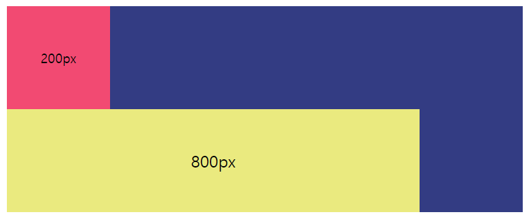

따로 설정을 하지 않는 한은 `display: block`인 div에 너비 값을 부여해도 block 요소이므로 각각 한 줄을 차지하지, 서로 붙지는 않는다. 남은 공간은 자동으로 부여된 margin으로 채워진다.

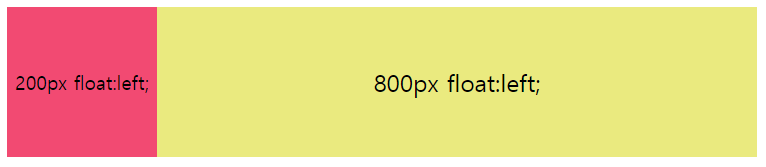

하지만 둘 모두에게 float: left를 준다면 `inline-block`이 된 것과 같은 효과가 생겨 다른 요소가 뒤에 따라붙도록 허용한다.

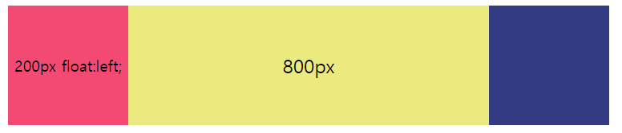

맨 왼쪽 요소에만 float: left를 주면 오른쪽 요소는 자동으로 따라붙어서 float: left를 안줘도 되는거 아닌가 하고 생각할 수 있는데, 200px짜리와 800px짜리 모두 왼쪽에 위치해서 겹치게 된다. 그래서 의도와는 달리 800px짜리가 실제 크기보다 작은 것처럼 보이게 된다. 이때의 200px짜리 블럭은 z-index 값을 갖는 것처럼 둥둥 떠있는 것이라고 생각하면 된다.

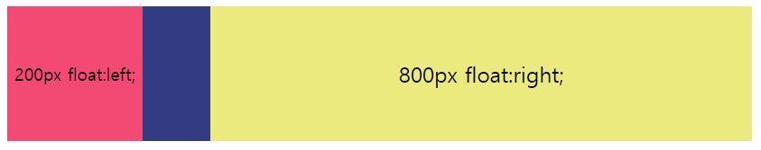

또 그러면 왼쪽 요소에는 float: left를, 오른쪽 요소에는 float: right를 주면 되지 않은가 하고 생각할 수 있다. 하지만 위의 그림처럼 container의 크기가 내부 요소들과 꼭 맞는 크기가 아니라면? 아니면 더 나아가 container의 크기가 % 단위라서 유동적이라면?  
container가 1100px인 경우 위의 그림처럼 요소들이 각각 좌우로 붙게 되어 가운데에 빈 공간이 생긴다. 그래서 둘 모두에게 float: left나 right처럼 일관된 방향을 부여한다면 container가 커진 경우에도 한 방향으로 잘 붙어있다.

### 2. float과 정렬 방향
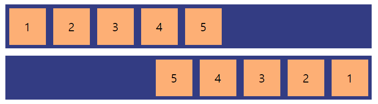

위의 것은 div에 모두 `float: left`를 한 것이고 아래에는 모두 `float: right`를 준 것이다. right를 한 요소는 순서가 반대인 것을 유념해야 한다. float는 이미 float된 요소 다음에 차곡차곡 쌓이게 되기 때문에 두 번째 그림에서는 1번 div가 먼저 맨 오른쪽으로 가서 붙고, 2번 요소에 right float을 주면 1번 옆에 붙게 되어 이런 순서를 가지는 것이다.

### 3. 쟤가 자꾸 따라붙어요! - clear
`float: left`를 준 이미지가 텍스트와 겹치지 않고 그 속에 자연스럽게 어우러지는 경우를 생각해보자. 이미지의 크기가 어떻게 변하든 텍스트는 이미지의 자리를 침범하지 않고 바로 뒤에 졸졸 따라온다.  
> float = 자신의 이전 혹은 다음 요소가 자신의 바로 옆에 따라붙게 하는 속성!

이라고 생각하면 clear를 쉽게 이해할 수 있을 것이다.
> clear는 자신은 float된 요소에 끌려가지 않겠다!는 속성이다.

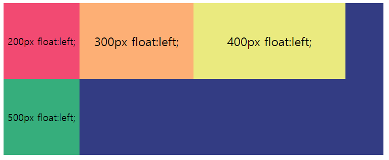

container의 너비가 1000px이여서 500px은 다음 줄로 내려온 상황이다. 그런데 나는 200px과 300px짜리 블럭이 한 줄, 400px과 500px짜리 블록이 한 줄씩 차지하게 하고 싶다. 어떻게 할까?  
300px 다음에 400px이 따라붙지 못하게 float의 따라붙게 하는 속성을 해제하면 된다.

`clear: left`는 float: left로 인해 받는 영향을 해제하고, `clear: right`는 float: right로부터 받는 영향을, `clear: both`는 left든 right든 상관없이 받는 영향을 해제할 수 있다. 그래서 보통은 편의를 위해 `clear: both를 쓴다.` 미리 `.clear { clear: both }`라고 설정해놓으면 엘리먼트에 `.clear`을 추가하는 것만으로도 간편하게 어떤 상황이든 쓸 수 있다.

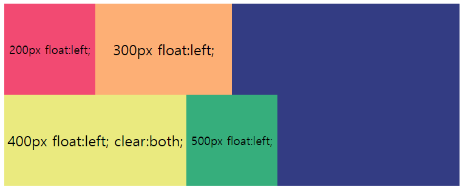

방법 1) 300px이 float: left 속성을 갖고 있어서 그 뒤의 400px짜리 div가 자동으로 따라붙게 된다. 그 영향을 해제하고자 400px 짜리에 clear: both를 준다. clear: left를 해도 같은 결과를 얻을 수 있다.

방법 2) 방법 1은 누구한테 clear를 줘야 할 지 헷갈린다. 그래서 `clear: both` 속성을 가진 아무 내용이 없는 빈 `\<div>`를 300px과 400px 둘 사이에 끼워넣어도 된다. 이 방법은 방향 뿐만 아니라 어떤 요소에 clear를 줘야 할지 신경쓰지 않아도 되기 때문에 자주 쓰이는 방법이다.

방법 3) CSS로 가상클래스를 추가하고 거기에 clear 속성을 줄 수도 있다. 300px짜리 div에게 `::after`로 가상클래스를 주고, 거기에 `clear: both`를 하거나, 400px짜리 div에게 `::before`로 가상클래스를 주고 `clear: both`를 주는 방법이다. 방법 2는 오직 스타일링을 위해 div를 끼워넣었기 때문에 시맨틱하지 않으므로 이렇게 가상클래스를 추가하는 방법도 많이 쓴다. 주의할 점은 가상클래스에 `contents: '';`와 `display: block;`을 쓰는 것을 잊으면 안된다.

## 진정한 비극의 시작 - float을 레이아웃에 사용하기
초창기 CSS의 목적은 '문서'를 꾸미는 것이었다. 이렇듯 텍스트와 이미지가 어우러지도록 배치하는 목적으로 만들어진 float을 레이아웃 배치에 사용하며 비극이 시작되었다.

[예제 코드](./code/clear_card_ui.html)

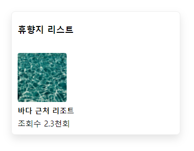

이미지를 왼쪽에 배치하고 싶어서 float: left를 준다면?

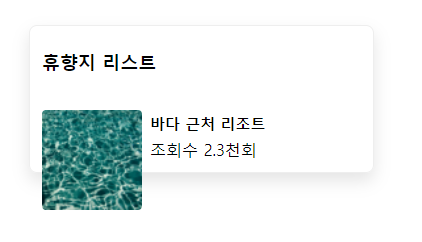

float은 요소를 맥락을 벗어나 둥둥 뜨게 만들어주기 때문에 container가 float된 요소의 크기를 인지하지 못하고 텍스트의 높이만을 감지하게 된다. 따라서 float으로 인한 영향을 해제하기 위해 `clear`해야 한다.

그렇다고 텍스트에 `clear`를 부여하게 된다면 img의 float으로 인해 이미지 옆에 따라 붙게 되던 효과가 해제되어, 이미지의 다음 줄로 내려가게 된다. 따라서 텍스트의 뒤쪽에 clear를 부여해야 한다. 마크업의 시맨틱을 해치지 않기 위해 clear를 부여한 \<div>를 텍스트 뒤에 추가하기 보다는, 텍스트의 뒤에 가상요소를 생성하고, clear 속성을 주자.

```CSS
  .item p::after {
    display: block;
    clear: both;
    content: '';
  }
```

주의할 점은 꼭 `display: block; content: '';`을 빼먹으면 안된다는 점이다. block은 가상요소가 한 줄을 차지하게 해주고, `content: ''`는 비록 내용이 비었지만 가상요소에 실체를 부여해준다.

clear로 이렇게 문제가 해결되었다.

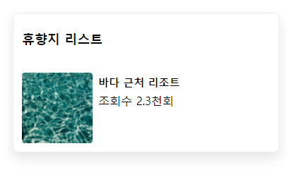

## 복잡한 레이아웃 만들기
다음과 같은 레이아웃을 만들고 싶다. 이건 flex로 만들기에는 복잡하므로 grid를 모른다면 오히려 float으로 만드는게 나을지도 모른다.

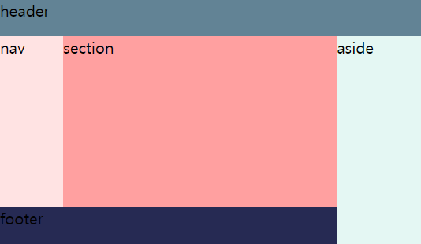

- header에는 아무런 float 속성을 주지 않고, `nav, section, aside`에는 `float: left`을 준다.
- nav, section의 높이는 header와 footer를 제외한 높이(%)를 주고, aside에는 header를 제외한 높이(%)를 주면 그림과 같은 모양을 만들 수 있다.
- footer는 `float: right`을 줘서 aisde 왼쪽에 달라붙게 한다. 너비는 aside를 제외한 너비(%)를 준다.

```html
<!-- html -->
<header>header</header>
<nav>nav</nav>
<section>section</section>
<aside>aside</aside>
<footer>footer</footer>
```

```css
/* CSS */
  * {
    margin: 0;
  }

  html, body {
    font-size: 20px;
    height: 100%;
    background-color: bisque;
  }

  header {
    height: 15%;
    background-color: #628395;
  }

  nav {
    float: left;
    width: 15%;
    height: 70%;
    background-color: #FFE3E3;
  }

  section {
    float: left;
    width: 65%;
    height: 70%;
    background-color: #FFA0A0;
  }

  aside {
    float: right;
    width: 20%;
    height: 85%;
    background-color: #e2f9f6ef;
  }

  footer {
    clear: left;
    float: left;
    width: 80%;
    height: 15%;
    background-color: #262A53;
  }
```

만약 nav, section, aside가 한 줄에 함께 있게 하고 싶으면 `nav, section, aside, footer`에게 모두 `float: left`를 준 다음에 `footer`에게만 clear 속성을 주면 된다.

## 나도 이제 float 레이아웃 만들기 전문가!
요즘은 구버전 IE를 제외하고는 flex를 지원하기 때문에 float을 이용해 레이아웃을 만들며 발생하는 골치아픈 일에 신경을 쓰지 않아도 되게 되었다.  
하지만
- IE를 대응해야 하거나🤮
- 유지보수를 해야 하는 경우가 있을 수 있고,
- 복잡한 레이아웃을 만들어야 하는데 flex로 하기에는 너무 복잡하지만 grid를 모른다면?

이런 상황을 생각하니 float로 레이아웃 만드는 법을 공부하길 잘했다는 생각이 든다.

## Reference
- [CSS float 속성 마스터하기|작성자 이야기꾼](https://blog.naver.com/PostView.nhn?blogId=iyakiggun&logNo=100165916259)
- https://colorhunt.co/palette/333c83f24a72fdaf75eaea7f - 코딩해서 예제 이미지를 만들 때 참고했던 컬러팔레트. Color Hunt라는 팔레트 모음 사이트인데, 꽤 괜찮은 것 같다.
- [#14 CSS Float 사용법 - 웹 코딩 강좌|디자인 베이스 Youtube](https://www.youtube.com/watch?v=JMX9FNoB6Cg)
