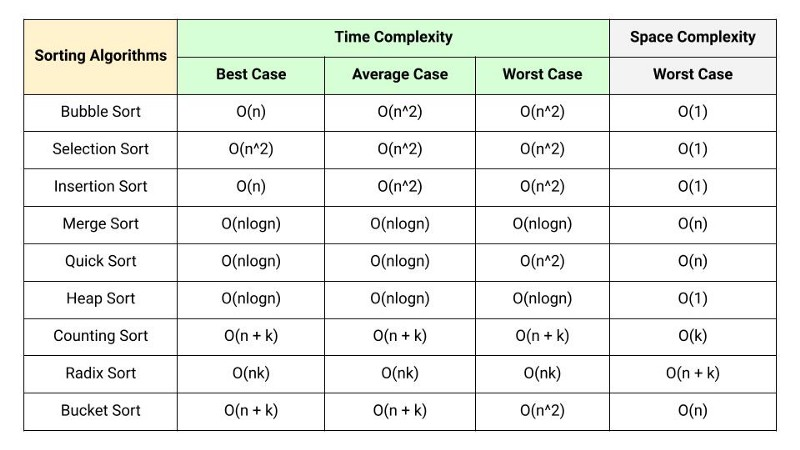
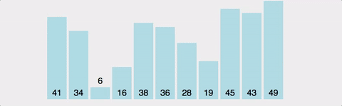

# 정렬
정렬을 해야하는 이유 - 데이터가 정렬되어 있다면 이진탐색이라는 강력한 알고리즘을 사용할 수 있다.

## 시간복잡도


빠른 순서  
O(1) > O(logn) > O(n) > O(nlogn) > O(n^2)

## 버블정렬 (Bubble sort)
~~쓰면 바보~~  성능이 최악이라 거의 학습용이다.  
n번째와 n+1번째를 비교해 더 큰 걸 뒤로 보내는 방식.  
1회전이 완료되면 가장 큰 것이 마지막으로 밀려오기 때문에 거품이 올라오는 것 같다고 해서 버블정렬이라는 이름을 가진다.
맨 뒤부터 정렬된다.



```js
function bubbleSort(arr) {
  for(let j = arr.length - 1; j > 0; j--) {
    for(let k = 0; k < j; k++) {
      if(arr[k] > arr[k + 1]) {
        [arr[k], arr[k + 1]] = [arr[k + 1], arr[k]];
      }
    }
  }
  return arr;
}
```

## 선택 정렬 (Selection sort)
앞에서부터 차례대로 훑으며 가장 작은 것을 선택한 다음 앞쪽으로 보낸다. 맨 앞부터 정렬된다.


특징
- 비교 횟수가 많지만 교환은 적다.
- 버블 정렬보다는 낫다.
- 이미 정렬된 상태여도 정렬을 확인하기 위해서 모든 요소를 순회해야 하기 때문에 어느 경우든지 시간 복잡도가 O(n^2)이다.
- 따라서 이미 정렬된 상태에서 새로운 데이터가 들어오면 효율이 좋지 않다.

\+ 처음부터 훑으며 최소값과 최대값을 동시에 찾아낸 다음, 최소값은 맨 앞으로, 최대값은 맨 뒤로 보내는 방식으로 동시에 정렬하는 정렬 방법도 있다. 이를 이중 선택 정렬이라고 한다. 선택 정렬보다 반복 횟수가 반으로 줄어든다.

pseudo
- 반복문으로 현재 

```js
function selectionSort(arr) {
  let minIndex;
  for(let j = 0; j < arr.length - 1; j++) {
    minIndex = j;
    for(let k = j + 1; k < arr.length; k++) {
      if(arr[k] < arr[minIndex]) {
        minIndex = k;
      }
    }
    [arr[j], arr[minIndex]] = [arr[minIndex], arr[j]];
  }
  return arr;
}
```

## 삽입 정렬 (Insertion sort)
두 번째 요소부터 시작해서 이미 앞의 회차에서 정렬된 부분을 훑으며 자신이 들어가야 할 위치를 찾아 삽입하는 정렬.


특징
- 이미 정렬된 배열에 새로운 데이터가 들어가야 할 때 유용하다.
- 정렬해야 하는 데이터가 역순으로 배치된 경우 자료구조에 따라서는 원래 있던 데이터를 한 칸 씩 밀어내느라 오버헤드가 매우 크다.
- 반대로, 이미 정렬이 된 배열에서는 순회하는데 O(n)의 시간밖에 안 걸리기 때문에 오버헤드가 매우 적다! 따라서 삽입/삭제를 할 때 최고의 알고리즘이다.

pseudo
- 배열의 두 번째부터 배열의 끝까지 반복하며 삽입할 값을 선택한다. (바깥 for문)
- 삽입할 값을 선택했다면 자신보다 한 칸 앞부터 0번 인덱스까지 인덱스를 1씩 감소시키며 삽입할 값이 비교 대상보다 작은 동안 둘을 교환한다. (안쪽 for문)
- 삽입할 위치를 찾은 다음 배열 뒤를 한 번에 미는거나 반복문으로 탐색하면서 둘을 교환해 한 칸씩 미는거나 효과가 같다.

```js
function insertionSort(arr) {
  for(let j = 1; j < arr.length; j++) {
    let currentValue = arr[j];
    for(let k = j - 1; k >= 0 && currentValue < arr[k]; k--) {
      [arr[k], arr[k + 1]] = [arr[k + 1], arr[k]];
    }
  }
  return arr;
}
```

## Reference
- https://jbhs7014.tistory.com/180
- https://www.crio.do/blog/top-10-sorting-algorithms/
- https://soldonii.tistory.com/93