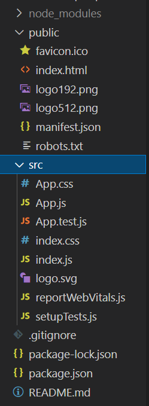

# React 시작하기

## 1. What is React?
### React를 사용하는 이유
- Virtual DOM
  - Vanilla JS로 DOM을 조작할 때마다 렌더 트리 재생성, 레이아웃 계산과 painting 등 일련의 과정이 반복해서 발생하는데, 점점 복잡해지는 웹과 인터랙션으로 인해 DOM 조작에 많은 리소스가 들게 되었다. 이 부담을 덜기 위해 등장한 개념이다.
  - 메모리 상에만 존재하는 가상 DOM은 데이터과 이전과 달라진 부분이 있다면 체크하고, 그 부분만 실제 DOM에 적용한다. 그래서 브라우저 전체를 재 렌더링 할 필요가 없다.  
  -> 빠른 속도
<br><br>
- 컴포넌트 기반의 화면 구성
  - 의미와 기능을 갖는 단위인 컴포넌트로 화면을 구성할 수 있으며, 재사용이 용이하다.
<br><br>
- Not framework! It's Library!
  - MVC 패턴 중 오직 View 만 신경쓰는 라이브러리이다.
  - 라이브러리이기 때문에 간편하게 다른 프레임워크에 덧붙일 수 있다.

<br>

## 2. 개발 환경 설정
### CDN으로 찍먹해보기
unpkg는 npm에 등록되어 있는 패키지를 CDN 형식으로 불러올 수 있도록 하는 서비스이다. 그래서 별다른 환경설정 없이 html의 적은 부분을 React로 관리할 때 이 방식을 쓸만하다.

1. index.html과 like_button.js 파일 두 개를 만든다.

2. html 파일의 script와 body에 다음 코드를 추가하자.
   ```html
   <!-- React 라이브러리 load -->
   <script src="https://unpkg.com/react@17/umd/react.development.js" crossorigin></script>  
   <script src="https://unpkg.com/react-dom@17/umd/react-dom.development.js" crossorigin></script>

   <!-- React 컴포넌트 파일 load -->
   <script defer src="like_button.js"></script>
   ```

   ```html
   <!-- React 컴포넌트를 표시할 곳 -->
   <div id="like_button_container"></div>
   ```

3. like_button.js에 다음 코드를 추가하자.
    ```javascript
    'use strict';

    const e = React.createElement;

    class LikeButton extends React.Component {
      constructor(props) {
        super(props);
        this.state = { liked: false };
      }

      render() {
        if (this.state.liked) {
          return 'You liked this.';
        }

        return e(
          'button',
          { onClick: () => this.setState({ liked: true }) },
          'Like'
        );
      }
    }

    const domContainer = document.querySelector('#like_button_container');
    ReactDOM.render(e(LikeButton), domContainer);
    ```

    document.querySelector()로 id가 'like_button_container'인 div를 선택한다. ReactDOM.render(React.createElement(LikeButton), domContainer)를 통해 domContainer \<div>에 LikeButton 컴포넌트를 렌더링한다.

<br>

### npm으로 환경 설정하기
node.js를 설치해야 패키지 매니저인 npm을 이용할 수 있다. 설치했다면 작업폴더에서 터미널을 열고
> *npx create-react app 프로젝트명*

를 입력한다.  
그 다음, 생성된 프로젝트 폴더를 열어 작업한다.

(npx는 npm이 지원하는 도구로, 로컬에 저장할 필요가 없는 일회용 설치 모듈을 다운받아 실행시킨 다음, 없애는 방식으로 작동한다)

#### 프로젝트 폴더 구조


- node_modules - 라이브러리 파일 모음
- public 폴더 - 자주 바뀌지 않는 정적 파일 모음
- src 폴더 - React를 실행하기 위한 파일 모음
- package.json - 설치한 라이브러리 목록들과 각 라이브러리를 실행하는 예약어 설정 모음

src 폴더
- index.html - id=”root” 인 div를 갖고 있으며, 여기에  모든 컴포넌트들이 들어간다.
- App.js - 컴포넌트 코드를 작성하는 곳
- index.js - 컴포넌트들을 조합하는 역할

src 폴더에서 꼭 필요한 파일은 *App.css, App.js, index.html, index.js, index.css*이다. 나머지는 지워도 된다.

#### 실행하기
> *npm start*

입력하면 로컬 서버가 실행되며 화면이 나타난다. localhost:3000번에서 확인할 수 있다.