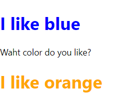

# Components와 Props
## 1. 들어가기에 앞서
### 컴포넌트란?
UI를 재사용 가능한 개별 조각으로 나눈 것
### props란?
properties의 줄임말.
html의 속성(attribute) 같은 값을 담고있는 객체라고 생각하면 된다.

```html
<!-- JSX -->
<button className="btn" style={{color: "blue"}} title="나를 클릭하세요">
    click me
</button>
```
여기서 className, style, title이 모두 props임. html 태그의 속성뿐 아니라 사용자가 정의한 속성도 전달할 수 있다.  
React 엘리먼트는 아래와 같은 구조로 이루어져 있어, 어떤 요소의 속성값에 접근하려면 props.title과 같이 접근하면 된다.
```javascript
{
    type: 'button',
    props: {
        className: 'btn',
        style: {color: 'blue'},
        title: '나를 클릭하세요',
        children: 'click me'
    }
}

```

## 2. 컴포넌트 선언법 (2가지)
### 함수 컴포넌트
```javascript
function Welcome(props) {
    return <h1>Hello, {props.name}</h1>;
}
```


### 클래스 컴포넌트
```javascript
class Welcome extends React.Component {
    render() {
        return <h1>Hello, {this.props.name}</h1>;
    }
}
```

함수 컴포넌트 - return문 전에 다른 로직을 작성해도 좋다. 마지막에 엘리먼트를 return 하기만 하면 된다.

클래스 컴포넌트 - React.Component를 상속받는 클래스를 선언하고, 아래에 render() 메소드를 선언한다.  
원래 class 안에서 함수는 function render(){} 형태로 선언해야 하지만 function 키워드가 없는 이유는 ES6에서 function 키워드를 생략해도 되기 때문이다.

컴포넌트를 사용할 때는 html 태그처럼 <Welcome></Welcome> 형태로 불러오면 된다. 컴포넌트는 템플릿 같은 것이고 props를 이용해 안에 있는 데이터가 달라지게 할 수 있다. <Welcome your_name="React"> 처럼 props를 전달하면 함수 안에서 {props.your_name} 으로 값을 읽을 수 있다.

## 3. 컴포넌트 만들어보기
### 기본 코드 분석하기
나만의 컴포넌트를 만들기 전에 react 프로젝트의 index.js, App.js에 기본적으로 있는 코드를 살짝 수정한 아래 예제를 살펴보자.  
ES6의 import, export 문법에 대해 찾아보면 좋다.

```javascript
// App.js
function App() {
  return (
    <div className="App">
      <h1>Hello, React!</h1>
      <span>I like it!<span>
    </div>
  );
}

export default App;
```
컴포넌트 선언법 2가지에서 봤듯이 이건 함수형으로 선언한 App이란 이름의 컴포넌트이다.

App.js에서는 ```export default App;```을 통해 App이란 함수(사실 컴포넌트)를 export하고 있다.
> export 할 때 default는 해당 파일(모듈)에 객체가 하나만 존재해서, 내보낼 객체가 그것뿐일 때에만 붙일 수 있다.

```javascript
// index.js
import React from 'react';
import ReactDOM from 'react-dom';
import App from './App';

ReactDOM.render(<App />, document.getElementById('root'));
```
그리고 index.js에서 ```import App from './App';```를 통해 App.js에서 App이란 이름의 함수(사실 컴포넌트)를 import하고 있다. 그리고 html 태그를 작성하듯이 \<App />처럼 컴포넌트를 사용한다.

나만의 컴포넌트를 만드려면 컴포넌트를 선언해서 html 태그처럼 사용하면 된다.  
App.js같이 한 파일 안에서 여러 컴포넌트를 조합해서 최종적으로 index.js에서는 그 컴포넌트만 렌더링하든가, 여러개의 컴포넌트를 모듈로 만들어서 index.js에서 조합해서 render()하면 된다.

<br>

> 프로젝트를 생성하면 있는 아래와 같은 기본 코드에서 <React.StrictMode>가 있는데 개발모드에서 잠재적인 위험에 대한 경고를 위한 도구이므로 필요없다면 지워도 괜찮다.
```javascript
ReactDOM.render(
  <React.StrictMode>
    <App />
  </React.StrictMode>,
  document.getElementById('root')
);
```

### 나만의 컴포넌트를 만들어보자
MyComponents라는 파일 안에 Color 컴포넌트를 만들어서 I like {color}! 처럼 문구를 출력하고 글자 색을 해당 color로 하고 싶다. 그리고 최종적으로 index.js에서 Color 컴포넌트와 \<p> 태그를 조합해서 화면에 render해주고 싶다.

```javascript
// MyComponents.js
function Color(props) {
    return <h1 style={{color: props.favorite_color}}>I like {props.favorite_color}</h1>;
}
  
export default Color;
```
props는 html 태그를 사용할 때와 다르게 꼭 html5 표준에 있는 속성뿐만 아니라 내가 만든 임의의 속성을 전달해도 된다.
```javascript
// index.js
import React from 'react';
import ReactDOM from 'react-dom';
import Color from './MyComponents';

ReactDOM.render(
  <div>
    <Color favorite_color="blue"></Color>
    <p>Waht color do you like?</p>
    <Color favorite_color="yellow"></Color>
  </div>,
  document.getElementById('root')
);
```




