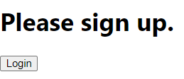
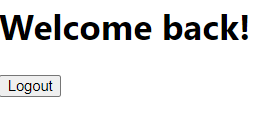
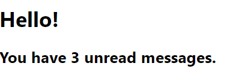

# 조건부 렌더링
조건문과 논리 연산자를 이용해 어떤 컴포넌트를 보여줄지 조건에 따라 결정할 수 있다.

## 1. 조건부 렌더링 예제
### 로그인 여부에 맞는 user / guest 컴포넌트 보여주기
```javascript
function UserGreeting(props) {
  return <h1>Welcome back!</h1>
}

function GuestGreeting(props) {
  return <h1>Please sign up.</h1>;
}

// 조건에 맞는 컴포넌트 반환하기
function Greeting(props) {
  const isLoggedIn = props.isLoggedIn;
  if(isLoggedIn) {
    return <UserGreeting />;
  }
  return <GuestGreeting />;
}

ReactDOM.render(
  <Greeting isLoggedIn={false} />,
  document.getElementById('root');
)
```

### 로그인 여부를 state로 저장하고, 로그인/로그아웃 버튼 추가
```javascript
// 컴포넌트들
function UserGreeting(props) {
  return <h1>Welcome back!</h1>;
}

function GuestGreeting(props) {
  return <h1>Please sign up.</h1>;
}

function Greeting(props) {
  const isLoggedIn = props.isLoggedIn;
  if (isLoggedIn) {
    return <UserGreeting />;
  }
  return <GuestGreeting />;
}

function LoginButton(props) {
  return (
    <button onClick={props.onClick}>
      Login
    </button>
  );
}

function LogoutButton(props) {
  return (
    <button onClick={props.onClick}>
      Logout
    </button>
  );
}
```

```javascript
// state가 있는 LoginControl 컴포넌트와 렌더링 부분
class LoginControl extends React.Component {
  constructor(props) {
    super(props);
    this.handleLoginClick = this.handleLoginClick.bind(this);
    this.handleLogoutClick = this.handleLogoutClick.bind(this);
    this.state = {isLoggined: false};
  }

  handleLoginClick() {
    this.setState({isLoggined: true});
  }

  handleLogoutClick() {
    this.setState({isLoggined: false});
  }

  render() {
    const isLoggined = this.state.isLoggined;
    let button;
    if(isLoggined) {
      button = <LogoutButton onClick={this.handleLogoutClick} />;
    } else {
      button = <LoginButton onClick={this.handleLoginClick} />;
    }

    return (
      <div>
        <Greeting isLoggined={isLoggined} />
        {button}
      </div>
    );
  }
}

ReactDOM.render(<LoginControl />,
  document.getElementById('root')
);
```

  


## 2. And(&&) 연산자로 if 대신하기
&& 연산자를 이용해 inline으로 if문을 표현할 수 있다.

true && expression은 true -> 렌더링 됨  
flase && expression은 false -> 렌더링 안 됨
```javascript
function MailBox(props) {
  const unreadMessages = props.unreadMessages;
  return (
    <div>
      <h1>Hello!</h1>
      {unreadMessages.length > 0 &&
        <h2>
          You have {unreadMessages.length} unread messages.
        </h2>
      }
    </div>
  );
}
const messages = ['React', 'Re: React', 'Re:Re: React'];
ReactDOM.render(<MailBox unreadMessages={messages}/>,
  document.getElementById('root')
);
```



### 주의! falsy한 값
```javascript
render() {
  const count = 0;
  return (
    <div>
      { count && <h1>Messages: {count}</h1>}
    </div>
  );
}
```
0은 flasy한 값이어서 &&의 오른쪽에 있는 표현식이 반환되지 않는 대신 count가 반환되어 \<div>0\</div>이 화면에 렌더링된다. 생각한 대로 화면에 엘리먼트가 렌더링되지는 않는 대신 그 자리에 0만 덩그러니 있다.


## 3. 삼항 연산자로 if-else 대신하기
짧은 구문을 렌더링할 때에는 if-else를 대신하기에 좋다. 조건이 너무 복잡해서 삼항 연산자를 쓰기에는 가독성이 떨어진다면 컴포넌트를 분리하기에 좋다는 신호일 수 있다.

<br>

짧은 구문
```javascript
render() {
  const isLoggedIn = this.state.isLoggedIn;
  return (
    <div>
      The user is <b>{isLoggedIn ? 'currently' : 'not'}</b> logged in.
    </div>
  );
}
```
조금 더 긴 구문
```javascript
render() {
  const isLoggedIn = this.state.isLoggedIn;
  return (
    <div>
      {isLoggedIn
        ? <LogoutButton onClick={this.handleLogoutClick} />
        : <LoginButton onClick={this.handleLoginClick} />
      }
    </div>
  );
}
```

## 4. null로 컴포넌트 렌더링 막기
```javascript
function WarningBanner(props) {
  if(!props.warn) {
    return null;
  }

  return(
    <div className="warning">
      Warning!
    </div>
  );
}

class Page extends React.Component {
  constructor(props) {
    super(props);
    this.state = {showWarning: true};
    this.handleToggleClick = this.handleToggleClick.bind(this);
  }

  handleToggleClick() {
    this.setState(state => ({
      showWarning: !state.showWarning
    }));
  }

  render() {
    return(
      <div>
        <WarningBanner warn={this.state.showWarning} />
        <button onClick={this.handleToggleClick}>
          {this.state.showWarning ? 'Hide' : 'Show'}
        </button>
      </div>
    );
  };
}

ReactDOM.render(
  <Page />,
  document.getElementById('root')
);
```

컴포넌트가 null을 반환하면 화면에 렌더링하지 않는다.

### setState() 주의사항
```javascript
  handleToggleClick() {
    this.setState(state => ({
      showWarning: !state.showWarning
    }));
  }
```
위의 예제에서 그냥 ```this.setState({showWarning: !state.showWarning})``` 하지 않고 왜 화살표 함수 형태로 작성했나? 하면 객체를 전달하는 방식은 이전 state를 불러올 수 없고 지정한 값으로만 바꿀 수 있기 때문이다. 따라서 이전 상태를 기반으로 값을 바꿔야 할 때(예- true/false 반전, 이전의 값에 덧셈 등)에는 1) this.state로 현재 값을 불러와 거기에 연산하는 방법, 2) ```this.setState(현재 state값 => ({key: new value}))``` 처럼 화살표 함수를 setState()의 파라미터로 주는 방법, 2가지가 있다.