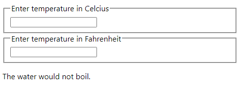

# State 끌어올리기

동일한 데이터에 대한 변경사항을 여러 컴포넌트가 공유해야 할 때, 가장 가까운 공통 조상 컴포넌트로 state를 끌어올리면 된다.

물의 끓는 여부를 추정하는 온도 계산기를 만들어 실습해보자.  
Calculator 컴포넌트에는 물의 온도를 입력하는 필드가 2개 존재하고 각각 섭씨, 화씨를 입력할 수 있다. 두 필드가 동기화되어서 한 필드에 온도를 입력하면 나머지 필드에 변환값이 출력된다. 두 필드의 아래에는 물이 끓을지에 대한 결과 문구가 출력되는 BoilingVerdict 컴포넌트가 존재한다.




## 1. 컴포넌트 생성
props로 받은 온도에서 물이 끓을지 여부를 출력
```javascript
function BoilingVerdict(props) {
  if(props.celsius >= 100) {
    return <p>The water would boil.</p>
  }
  return <p>The water would not boil.</p>
}
```

온도 입력 필드
```javascript
const scaleNames = {
  c: 'Celcius',
  f: 'Fahrenheit'
};

class TemperatureInput extends React.Component {
  constructor(props) {
    super(props);
    this.handleChange = this.handleChange.bind(this);
    this.state = {temperature: ''};
  }

  handleChange(e) {
    this.setState({temperature: e.target.value});
  }

  render() {
    const temperature = this.state.temperature;
    const scale = this.props.scale;
    return (
      <fieldset>
        <legend>Enter temperature in {scaleNames[scale]}</legend>
        <input
          value={temperature}
          onChange={this.handleChange} />
      </fieldset>
    );
  }
}
```

Calculator 컴포넌트
```javascript
class Calculator extends React.Component {
  render() {
    return (
      <div>
        <TemperatureInput scale="c" />
        <TemperatureInput scale="f" />
      </div>
    );
  }
}
```

## 2. 온도 변환 함수

섭씨/화씨 온도 변환 함수
```javascript
function toCelsious(fahrenheit) {
  return (fahrenheit - 32) * 5 / 9;
}

function toFahrenheit(celsius) {
  return (celsius * 9/ 5) + 32;
}
```

temperature 문자열과 온도 변환 함수를 인수로 해서 온도를 변환하고, 결과를 문자열 형태로 반환
```javascript
function tryConvert(temperature, convert) {
  const input = parseFloat(temperature);
  if(Number.isNaN(input)) {
    return '';
  }
  const output = convert(input);
  const rounded = Math.round(output * 1000) / 1000;
  // 소수 셋째 자리까지 반올림
  return rounded.toString();
}
```

## 3. State 끌어올리기
현재까지는 두 개의 TemperatureInput 컴포넌트가 각자의 입력값을 자신의 state에 저장하고 있다. 두 입력값이 동기화되어서 한 온도를 변경하면 다른 쪽도 단위만 다른 동일한 값을 가지길 원한다.

이를 위해 두 컴포넌트와 가장 가까운 공통 조상으로 state를 끌어올릴 것이다. 그리고 두 필드는 부모의 state를 props로 전달받는다.

### Temperature Input 컴포넌트
지역 state를 제거하고, temperature를 `this.state`에서 참조하는 게 아니라 `this.props`에서 참조하는 것으로 바꾸기
```javascript
render() {
  // const temperature = this.state.temperature;
  const temperature = this.props.temperature;
```

그런데 props는 읽기 전용이므로 입력값이 바뀔 때마다 props를 수정할 수 없다.  
그렇지만 어차피 props는 상위 컴포넌트의 state를 받은 것이고, 두 입력폼이 값을 공유해야 하므로, props를 수정하는 대신 상위 컴포넌트의 state를 수정하면 된다.  
이를 위해 상위 컴포넌트의 state 변경 함수를 props에 onTemperatureChange라는 이름으로 전달한다.

입력값이 바뀔 때마다 실행되는 handleChange() 함수 안에서 `this.setState()` 대신 `this.props.onTemperatureChange`를 호출하도록 바꾸자.
```javascript
handleChange(e) {
  this.props.onTemperatureChange(e.target.value);
}
```

결과
```javascript
class TemperatureInput extends React.Component {
  constructor(props) {
    super(props);
    this.handleChange = this.handleChange.bind(this);
  }

  handleChange(e) {
    this.props.onTemperatureChange(e.target.value);
  }

  render() {
    // const temperature = this.state.temperature;
    const temperature = this.props.temperature;
    const scale = this.props.scale;
    return (
      <fieldset>
        <legend>Enter temperature in {scaleNames[scale]}</legend>
        <input
          value={temperature}
          onChange={this.handleChange} />
      </fieldset>
    );
  }
}
```

### Calculator 컴포넌트
Calculator 컴포넌트는 state에 temperature와 scale 값을 저장한다.   
만약 둘 중 섭씨 입력 필드에 37라는 값이 입력되면 state는 다음과 같을 것이다.
```javascript
{
  temperature: '37',
  scale: 'c'
}
```
화씨 입력 필드의 값을 212로 수정하면 state는 다음과 같이 변할 것이다.
```javascript
{
  temperature: '212',
  scale: 'f'
}
```

`TemperatureInput`에 props를 통해 `onTemperatureChange`라는 이름으로 state를 변경할 수 있는 함수(`handleCelsiusChange`, `handleFahrenheitChange`)를 전달한다.  
만약 입력값이 변경되면 input의 `onChange` 이벤트가 발생해서 `handleChange()`가 실행되고, `onTemperatureChange`로 전달받은 state 변경 함수가 실행된다.

섭씨 입력 폼에 등록된 `handleCelsiusChange` 메서드는 scale을 'c'로 설정하고, 화씨 입력 폼에 설정된 메서드 `handleFahrenheitchange`는 scale을 'f'로 설정하므로 state를 보고 입력된 온도가 어느 단위를 기준으로 하는지 알 수 있다.

그렇게 this.setState()로 state가 업데이트되면 render() 안의 코드를 다시 실행하게 되면서 섭씨와 화씨 온도 모두를 다시 계산하고, 두 개의 입력필드에 props로 각자의 temperature를 전달한다. 그러면 두 입력필드의 값이 동기화된다.

```javascript
class Calculator extends React.Component {
  constructor(props) {
    super(props);
    this.state = {temperature: '', scale: 'c'};
    this.handleCelsiusChange = this.handleCelsiusChange.bind(this);
    this.handleFahrenheitChange = this.handleFahrenheitChange.bind(this);
  }

  handleCelsiusChange(temperature) {
    this.setState({scale: 'c', temperature});
  }

  handleFahrenheitChange(temperature) {
    this.setState({scale: 'f', temperature});
  }

  render() {
    const scale = this.state.scale;
    const temperature = this.state.temperature;

    const celsius = scale === 'c'
                  ? temperature
                  : tryConvert(temperature, toCelsius);
    const fahrenheit = scale === 'f'
                  ? temperature
                  : tryConvert(temperature, toFahrenheit);

    return (
      <div>
        <TemperatureInput
          scale="c"
          temperature={celsius}
          onTemperatureChange={this.handleCelsiusChange}
        />
        <TemperatureInput
          scale="f"
          temperature={fahrenheit}
          onTemperatureChange={this.handleFahrenheitChange}
        />
        <BoilingVerdict celsius={parseFloat(celsius)} />
      </div>
    );
  }
}

ReactDOM.render(<Calculator />, document.getElementById('root'))
```

## 4. 요약
1. React는 props를 통해 데이터가 위에서 아래로 흐른다. (하향식, 단방향)  
하지만 자식 컴포넌트도 부모 컴포넌트에게 값을 전달할 수 있는 방법이 있다. 부모 컴포넌트가 자신의 state를 변경할 수 있는 함수를 자식에게 전달해주면, 자식이 그 함수로 부모의 state를 변경하는 방식으로 데이터를 전달한다.
2. 만약 여러 개의 컴포넌트가 어떤 값을 공통으로 필요하게 되면 각자 갖고 있던 state를 그들의 공통 조상으로 끌어올리면 된다. 그리고 값의 동기화는 부모 컴포넌트가 준 함수를 통해 이루어진다.
3. 만약 어떤 값이 state로부터 계산될 수 있다면 그 값은 state에 저장하지 않는 것이 좋다. (예- `temperature`와 `scale`만 저장하고 `celsiusValue`와 `fahernheightValue`는 저장하지 않기).  state 값을 기반으로 하는 값들은 state가 변경될 때마다 render()에서 매번 다시 계산된다. 그런 값을 저장하지 않음으로써 사용자 입력값의 정밀도를 유지할 수 있고, state를 기반으로 계산되는 값들에 추가적으로 반올림 같은 계산을 적용할 수도 있다.